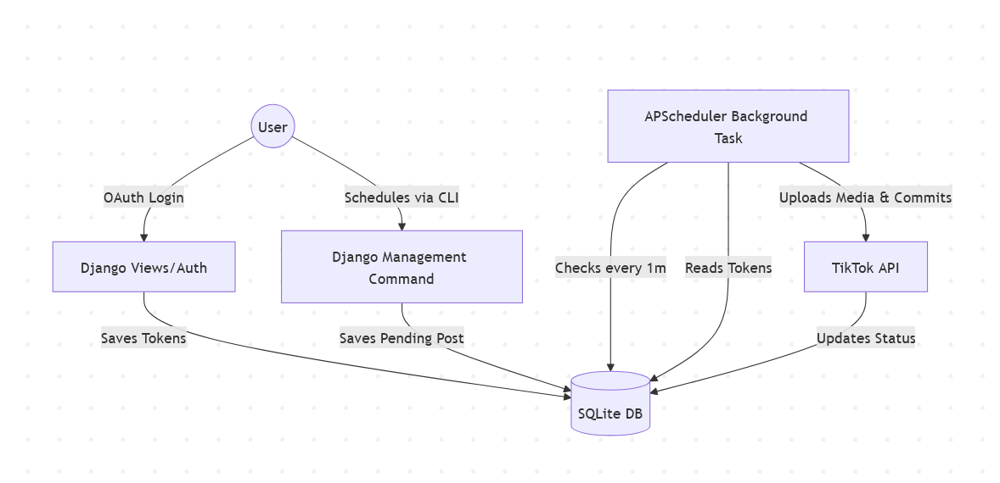

# TikTok Scheduler (Django PoC)

A standalone Proof of Concept for scheduling and automatically publishing video content to TikTok using the official TikTok Content Posting API. Built with Django, this PoC is designed to be easily integrated into larger Django-based applications.

## Architecture



## Setup Instructions

1. **Install Dependencies:**
   Ensure you have Python installed, then run:
   ```bash
   pip install -r requirements.txt
   ```

2. **Configure Environment Variables:**
   Rename `.env.example` to `.env` or create a new `.env` file in the root directory.
   **Crucial:** You must register an app on the [TikTok Developer Portal](https://developers.tiktok.com/) and provide your credentials.

   ```ini
   # Update these with your real TikTok API credentials:
   TIKTOK_CLIENT_ID=your_client_key_here
   TIKTOK_CLIENT_SECRET=your_client_secret_here

   # Keep this as is for local testing:
   REDIRECT_URI=http://localhost:8000/callback
   
   DATABASE_URL=sqlite:///tiktok_scheduler.db
   TIMEZONE=UTC
   ```

3. **Initialize Database:**
   ```bash
   python manage.py makemigrations tiktok_scheduler
   python manage.py migrate
   ```

## Usage

1. **Authenticate your Account:**
   Start the Django server:
   ```bash
   python manage.py runserver
   ```
   Visit `http://localhost:8000` in your browser and click the link to authorize the application. This securely stores your OAuth tokens in the database.

2. **Schedule a Post:**
   In a new terminal window, schedule a post (e.g., for 2 minutes from now):
   ```bash
   python manage.py schedule_post --file "path/to/video.mp4" --caption "My scheduled video! #test" --delay 2
   ```

3. **Run the Background Scheduler:**
   ```bash
   python manage.py run_scheduler
   ```
   Keep this running in the background. It will automatically detect pending posts, refresh your access token if necessary, upload the media, and publish it to TikTok when the scheduled time arrives.
