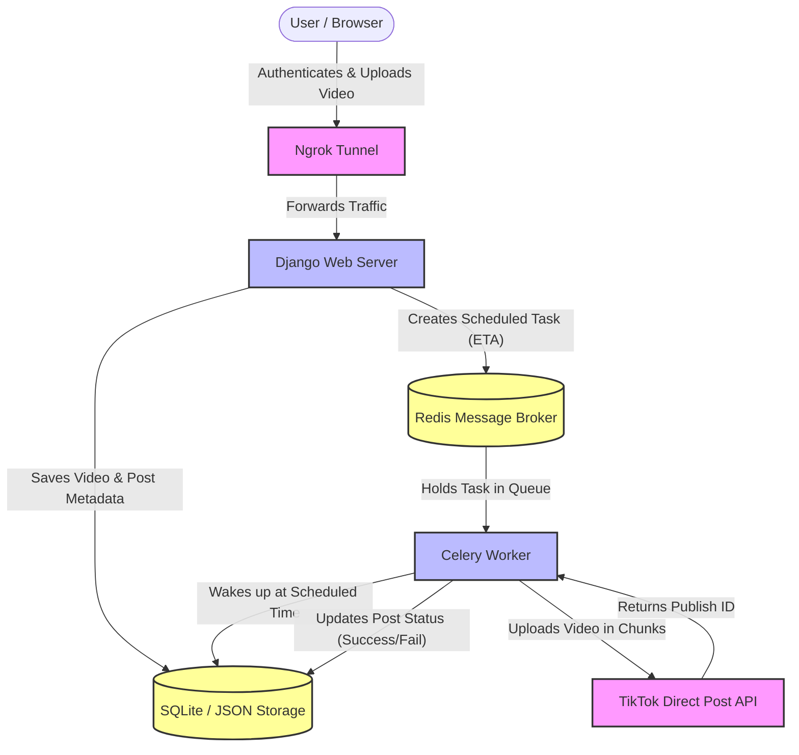

# TikTok Scheduler (Django + Celery) (3rd)

A complete full-stack web application for securely authenticating users and scheduling video content to be published automatically using the official TikTok Direct Post API.

## Architecture



## Setup Instructions

1. **Install Dependencies:**
   Ensure you have Python installed, then run:
   ```bash
   pip install -r requirements.txt
   ```

2. **Configure Environment Variables:**
   Rename `.env.example` to `.env` or create a new `.env` file in the root directory.
   **Crucial:** You must register an app on the [TikTok Developer Portal](https://developers.tiktok.com/) and provide your credentials.

   ```ini
   # Update these with your real TikTok API credentials:
   TIKTOK_CLIENT_ID=your_client_key_here
   TIKTOK_CLIENT_SECRET=your_client_secret_here
   
   # For local testing with your local timezone
   TIMEZONE=Asia/Dubai
   DATABASE_URL=sqlite:///tiktok_scheduler.db
   ```

3. **Initialize Database:**
   ```bash
   python manage.py makemigrations
   python manage.py migrate
   ```

## Usage (Local Development)

To make local development effortless, we have included an automator script (`start_all.py`).

1. **Start the Ngrok Tunnel:**
   In a terminal, expose port 8000 so TikTok can send OAuth callbacks:
   ```bash
   ngrok http 8000
   ```

2. **Start the Application Stack:**
   In a second terminal, run the automator:
   ```bash
   python start_all.py
   ```
   This script will:
   - Auto-detect your active Ngrok URL and update your `.env` file.
   - Automatically download and start a local Redis server (for Windows).
   - Boot up the Django Web Server.
   - Boot up the Celery background worker.

3. **Schedule a Post:**
   - Visit the Ngrok URL printed in your terminal.
   - Click **Connect with TikTok** to securely authorize your account.
   - Drag and drop an `.mp4` file, add a caption, and select a future date/time.
   - The Celery worker will wait in the background and automatically publish the video exactly when scheduled!
